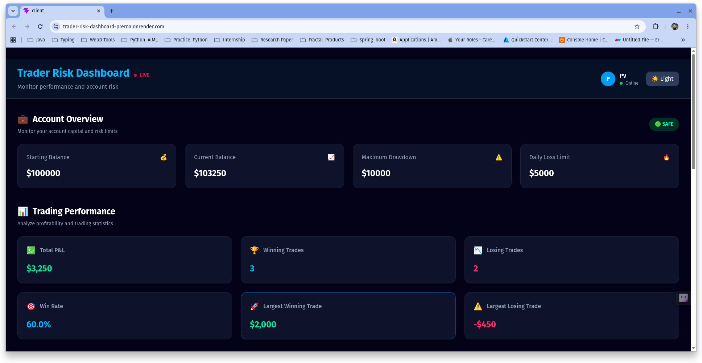
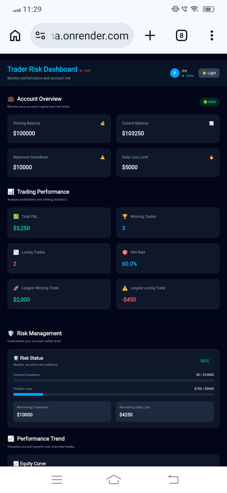
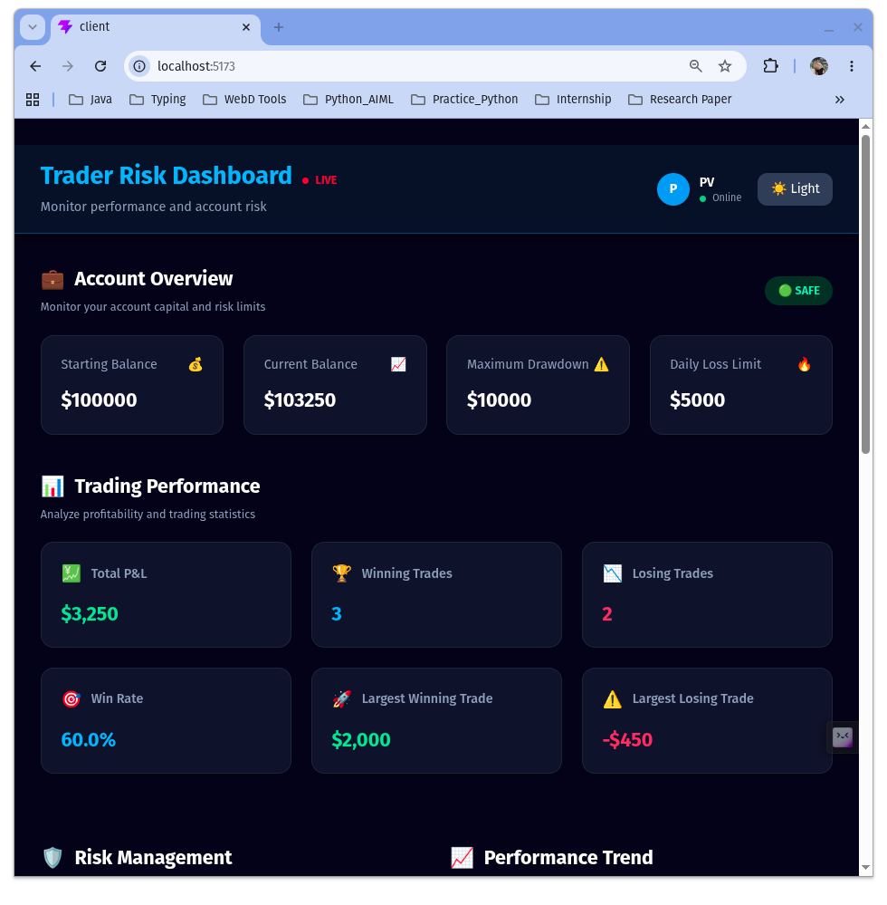
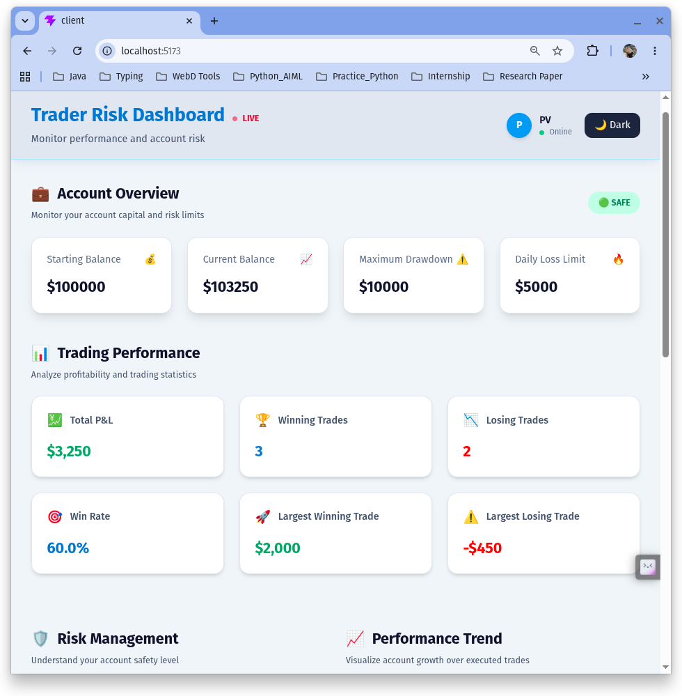
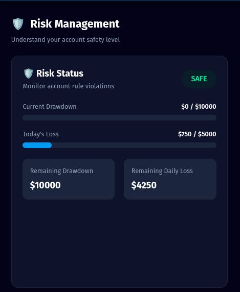
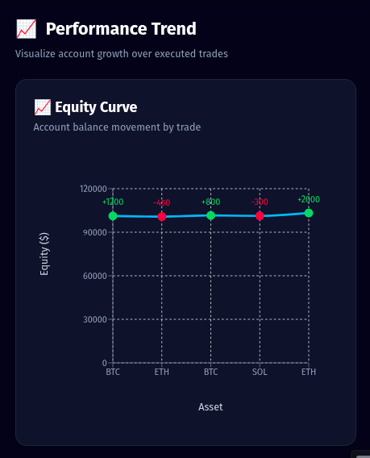
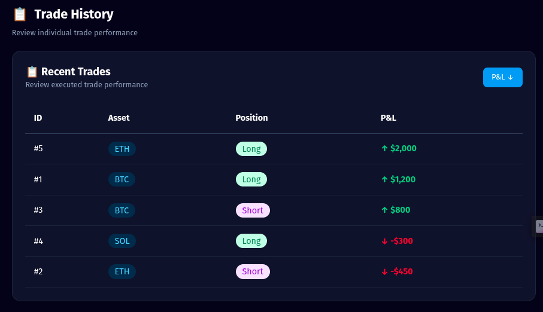

# 📊 Trader Risk Dashboard

A full-stack trading risk monitoring dashboard that helps traders track account performance, profitability metrics, and risk exposure.

The dashboard derives all calculations dynamically from trade data and provides a quick overview of whether the trader is operating safely within account limits.

---

## Live Demo

- **Frontend:** https://trader-risk-dashboard-prerna.onrender.com
- **Backend API:** https://trader-risk-dashboard-api.onrender.com/api/dashboard

---

# Screenshots

## Dashboard Overview

### Laptop View

<p align="center">
  
</p>


### Mobile View

<p align="center">
  
</p>


### Dark Trading Theme

<p align="center">
  
</p>


### Light Theme

<p align="center">
  
</p>


## Risk Management Indicator

<p align="center">
  
</p>


## Equity Curve

<p align="center">
  
</p>


## Trade History

<p align="center">
  
</p>


---

# Features Built

## Account Overview

Displays:

- Starting Balance
- Current Balance
- Maximum Drawdown
- Daily Loss Limit
- Current Risk Status


## Trading Performance

The dashboard dynamically calculates:

- Total P&L
- Winning Trades
- Losing Trades
- Win Rate
- Largest Winning Trade
- Largest Losing Trade


All metrics are calculated from trade data and are not hardcoded.


## Risk Management

The dashboard helps traders understand their current account safety by displaying:

- Current Drawdown
- Remaining Drawdown
- Current Daily Loss
- Remaining Daily Loss Limit
- Risk Status


Risk states:

- SAFE
- APPROACHING LIMIT
- AT RISK


## Trade History

A responsive trade table showing:

- Trade asset
- Position type (Long/Short)
- Profit/Loss value
- Profit and loss indicators


## Theme Support

Implemented:

- Dark trading terminal inspired theme
- Light mode support
- Smooth theme transition
- Responsive design for desktop and mobile


---

# Additional Feature

## Equity Curve Visualization


I added an equity curve as an additional feature.


### Why?

A trader does not only need to know the final profit or loss.

The journey of account growth is equally important.


The equity curve helps traders identify:

- Consistent growth patterns
- Drawdown periods
- Losing streaks
- Recovery after losses


The chart is generated dynamically from executed trade data.


---

# Tech Stack


## Frontend

- React.js
- Vite
- Tailwind CSS
- Axios
- Recharts


## Backend

- Node.js
- Express.js
- CORS


## Data Storage

Mock trade data is used as allowed by the assignment.

No database or authentication was implemented because they were not required for this task.


---

## Project Architecture

```text
React Dashboard
       │
       ▼
Axios API Request
       │
       ▼
Express Backend
       │
       ▼
Dashboard Controller
       │
       ▼
Dashboard Service
       │
       ▼
Calculation Utilities
       │
       ▼
Mock Data
```

---

## Installation


Clone repository:


git clone https://github.com/PrernaVarshneySophomore/Trader_Risk_Dashboard.git


Install backend dependencies:


cd server

npm install


Install frontend dependencies:


cd client

npm install

---

## Running Application


Start backend:


cd server

npm start


Backend runs on:

http://localhost:5000


Start frontend:


cd client

npm run dev


Frontend runs on:

http://localhost:5173


---

# Product Questions


## 1. What is drawdown in trading?


Drawdown represents the decline in account value from its highest achieved balance to the current balance.


For example:

If a trading account reaches $110,000 and later falls to $102,000, the drawdown is:

$110,000 - $102,000 = $8,000


It helps measure the risk and losses experienced during trading.


---

## 2. Why would a trader care about remaining drawdown rather than only current P&L?


Current P&L only shows the profit or loss at a particular moment.


Remaining drawdown tells the trader how much additional loss they can sustain before violating their account rules.


For example, a trader may currently be profitable, but if they are close to their maximum drawdown limit, they need to reduce risk and avoid large positions.


Therefore, remaining drawdown provides a better understanding of account safety.


---

## 3. If you had another day to work on this dashboard, what would you improve?


With additional time, I would improve the dashboard by adding:


- Real-time updates using WebSockets
- Multiple account support
- Historical performance analytics
- Filtering trades by asset/date
- User authentication
- Persistent storage using a database
- More advanced risk metrics such as risk percentage and position exposure

---

## Folder Structure

```text
Trader-Risk-Dashboard/
│
├── client/
│   ├── src/
│   ├── public/
│   └── package.json
│
├── server/
│   ├── controllers/
│   ├── routes/
│   ├── services/
│   ├── utils/
│   ├── data/
│   └── package.json
│
├── screenshots/
├── README.md
└── .gitignore
```

---

## Why This Architecture?

Although the assignment allowed using mock data without a database, I chose to build the project using a clean client-server architecture. Business logic is handled entirely in the Express backend, while the React frontend focuses only on presentation. This separation improves maintainability, promotes code reuse, and reflects real-world full-stack development practices.

---

# Author

Prerna Varshney

---

## License

This project was developed as part of a Full Stack Developer assignment and is intended for educational and portfolio purposes.

